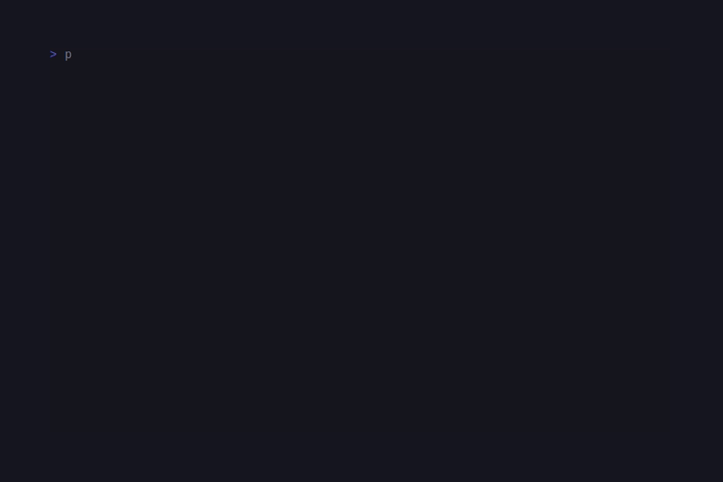
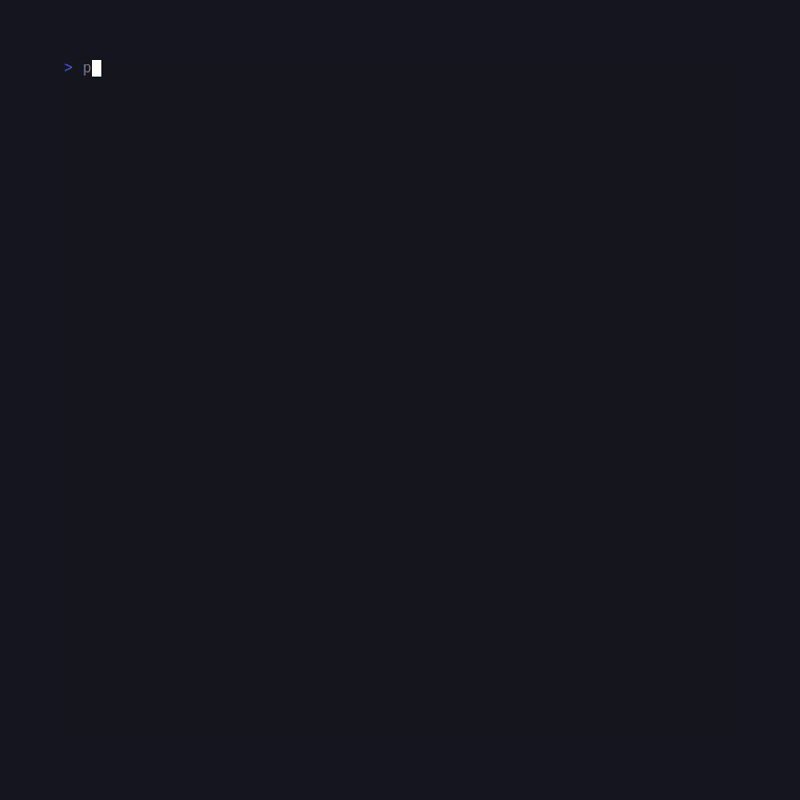

# CandyShine



PHP port of [charmbracelet/glamour](https://github.com/charmbracelet/glamour) —
Markdown → ANSI renderer built on `league/commonmark` and CandySprinkles.

```sh
composer require candycore/candy-shine
```

## Quickstart

```php
use CandyCore\Shine\Renderer;

echo (new Renderer())->render(<<<MD
# Welcome

A few **bold** and _italic_ words, with `inline code` and a
[link](https://example.com).

- one
- two
- three

```php
echo "hello world";
```
MD);
```

## Themes

Stock presets:

```php
use CandyCore\Shine\{Renderer, Theme};

new Renderer(Theme::ansi());        // default colourful
new Renderer(Theme::plain());       // no SGR
new Renderer(Theme::notty());       // alias for plain — non-TTY fallback
new Renderer(Theme::dark());        // dark-bg optimised
new Renderer(Theme::light());       // light-bg optimised
new Renderer(Theme::dracula());     // #282a36 / #ff79c6 palette
new Renderer(Theme::tokyoNight());  // #1a1b26 / #7aa2f7
new Renderer(Theme::pink());        // playful sweet palette
```

Custom JSON theme:

```php
$theme = Theme::fromJson('./themes/my-theme.json');
echo (new Renderer($theme))->render($markdown);
```

JSON shape: an object keyed by element name (`heading1`, `paragraph`,
`bold`, `italic`, `code`, `codeBlock`, `link`, `blockquote`,
`listMarker`, `rule`, `keyword`, `string`, `number`, `comment`,
`strike`, `linkText`, `image`, `htmlBlock`, `htmlSpan`,
`definitionTerm`, `definitionDescription`, `text`, `autolink`); each
value carries `foreground` / `background` (hex / `ansi:N` /
`ansi256:N`) plus the SGR flags (`bold`, `italic`, `underline`,
`strike`, `faint`, `blink`, `reverse`).

## Word-wrap + OSC 8 hyperlinks

```php
$renderer = (new Renderer(Theme::dark()))
    ->withWordWrap(80)
    ->withHyperlinks(true);

echo $renderer->render($markdown);
```

`withHyperlinks(true)` (default) wraps every `[text](url)` in
`OSC 8 ; ; URL ST text OSC 8 ; ; ST` so terminals that support it
render real clickable links. Falls back to `text (url)` when off.

## What it renders

- Headings 1-6, paragraphs, `**bold**`, `_italic_`, `~~strike~~`.
- Inline code, fenced code blocks (with regex syntax highlighting for
  PHP / JS / TS / JSON / Python / Go / Bash / SQL), indented code.
- Bullet + ordered + nested lists.
- Block quotes (▎-prefixed).
- GFM tables (rendered via `Sprinkles\Table` with rounded border).
- Task lists (`☑` / `☐`).
- Links (with OSC 8 hyperlinks), autolinks, images (alt + url).
- HTML blocks + inline HTML — pass through with theme styling.
- Thematic breaks.

## Test

```sh
cd candy-shine && composer install && vendor/bin/phpunit
```

## Demos

### Render


### Themes



